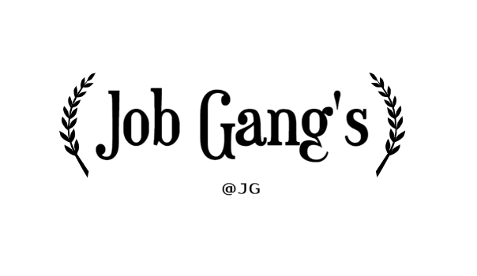

## Job-Gangs

  

-----

  
  
  
   
  
  
  
   
   
   

# o>>> Job-Gangs  <<<o

# Job-Gangs Documentation
 o> Description
  Job-Gangs is an Project for managing a collection of car, allowing users to buy, sell, and view details about their car.This documentation provides details on the available endpoints and how to use them.

# Getting Started
 To get started with the Job-Gangs, follow these steps:

# Clone the repository.
 - Install dependencies using npm install(npm i).
 - Set up the database by running migrations with npm run migrate.
 - Start the server with npm start / nodemon in server.
 - Start the client with npm run dev.

o> Install them using `npm install`.

 # External APIs
....

# Note
I'm really sorry for the project it still can't support mobile due to time. Maybe the mobile version is still coming soon

# o>>> Explore the Project endpoints detailed below.